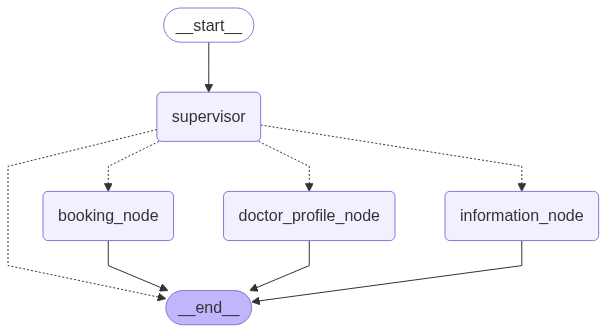

# LangGraph Supervisor Multi-Agent System

This project implements a multi-agent system using LangGraph, designed to coordinate and supervise multiple agents for complex task execution. The system is modular, extensible, and leverages a graph-based approach to manage agent interactions and workflows.

**What the project does:**
- Coordinates multiple agents, each with specific roles, to solve complex tasks collaboratively.
- Uses a supervisor agent to manage and delegate tasks among agents.
- Employs a graph-based workflow to define and control agent interactions.
- Provides an example scenario for managing doctor availability and scheduling in a healthcare context.
- Uses gpt-4o-mini as llm model
- Uses text-embedding-ada-002 as embeddings model
- Uses FAISS as vector database to store and retrieve information about doctors
- Uses FastAPI to expose the agents as a web service

## Agents Overview
Each agent in the system has a specific role:

- **Supervisor Agent:**
    - Oversees the workflow and delegates tasks to other agents based on the current requirements.
    - Ensures coordination and manages the overall process.

- **Availability Agent:**
    - Checks and manages the availability of doctors or resources.
    - Handles queries related to schedules and open slots using data in availability.csv.

- **Booking Agent:**
    - Books appointments or allocates resources based on availability.
    - Stores data in availability.csv.

- **Doctor Profile Agent:**
    - Provides detailed information about doctors backgrounds and specialties.
    - On startup of agent the file doctor_information.txt is read in and trasformed into embeddings and put into the vector database FAISS
    - Tool is exposed to retireve data from the vector database FAISS
    - 
  

## Getting Started

### Prerequisites
- Python 3.10+
- Recommended: Create a virtual environment


### Installation
1. Clone the repository:
   ```bash
   git clone https://github.com/hammadyaqoob1985/langgraph-supervisor-multiagent
   cd langgraph-supervisor-multiagent
   ```
2. Install dependencies:

   **Required dependencies:**
   - langgraph
   - pandas
   - fastapi
   - pydantic

   pip install langgraph pandas fastapi pydantic


3. Have the following API Keys and parameters passed in from the .env file:
   - ANTHROPIC_API_KEY="ANTHROPIC API KEY"
   - LANGSMITH_TRACING=true
   - LANGSMITH_ENDPOINT="https://api.smith.langchain.com"
   - LANGSMITH_API_KEY= "LANGSMITH API KEY"
   - LANGSMITH_PROJECT=langgraph-supervisor-multiagent

## Diagram




